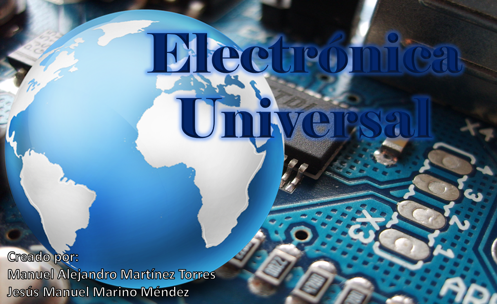

## Acerca del proyecto

- Nombre del proyecto: Electronica Universal

- Descripción del objetivo del proyecto: Elaborar un sistema eficiente y eficaz para un establecimiento de electronica, logrando un administracion y control de las comprobantes además del inventario, desde articulos hasta refacciones, e incluso, las refacciones que utilizan estos articulos.

- Integrantes: Jesús Marino y Manuel Martínez.

- Instrucciones de instalación: Ninguna (Utilización de laravel JetStream).

